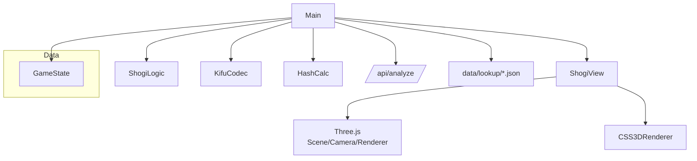

# game.ts 詳細設計書

## 1. プログラムファイルの意図
`game.ts` は、4x4ミニ将棋の対局体験をブラウザ上で成立させるための「UI/描画・ルール・進行・AI連携」を一つにまとめた統合モジュールです。3D表示（Three.js）とDOM UIを協調させ、ユーザー入力→合法手判定→局面更新→AI解析→結果表示までを一気通貫で制御します。主目的は以下です。

- 3D盤面・持ち駒の描画と操作性の確保
- ルールに基づく合法手の検証・反映
- 局面履歴（Undo/Redo）と棋譜表示
- Cloudflare Workers APIによる局面評価・AI自動指し
- 勝敗演出・サウンド・共有導線

## 2. クラス（オブジェクト）単位の構成フローチャート (mermaid)

## 3. クラス（オブジェクト）単位の入出力

### 3.1 グローバル・定数
- `CONFIG`
  - 入力: なし
  - 出力: 盤・セル・台の寸法、派生値 `GRID_WIDTH`, `BOARD_WIDTH` など
- `PIECE_TYPES`
  - 入力: なし
  - 出力: 駒名・移動方向・スライド可否を定義した辞書

### 3.2 GameState（状態コンテナ）
- 役割: 盤面・手番・履歴・選択状態を保持
- 入力:
  - `reset()` 呼び出し（明示的初期化）
  - `Main` からの状態更新（盤/履歴/選択）
- 出力:
  - `Main` / `ShogiView` / `ShogiLogic` へ現在局面を提供

### 3.3 KifuCodec（棋譜変換）
- 役割: 座標/駒/指し手の符号化と日本語棋譜生成
- 入力:
  - `MoveRecord` / 座標 / 駒種 / 棋譜文字列
- 出力:
  - 棋譜文字列、座標、`MoveRecord`、日本語棋譜表記

### 3.4 ShogiLogic（ルール判定）
- 役割: 初期配置、擬似合法手、自己王手回避を含む合法手判定
- 入力:
  - 盤面、手番、選択情報、目的座標
- 出力:
  - 合法/非合法判定
  - `GameState` への初期配置反映

### 3.5 HashCalc（局面ハッシュ）
- 役割: 局面をRust互換形式に符号化し、対称性を正規化
- 入力:
  - `GameState`
- 出力:
  - BigIntハッシュ、32桁HEX文字列

### 3.6 ShogiView（描画/UI）
- 役割: 3D盤面とCSS3D文字の描画、入力ヒット領域の構築
- 入力:
  - `GameState`（render/ハイライト用）
  - windowサイズ/イベント
- 出力:
  - Three.js 描画結果、DOM/CSS3D表示

### 3.7 Main（制御/進行）
- 役割: 入力処理、指し手確定、履歴管理、AI連携、UI更新
- 入力:
  - PointerEvent、GameState、APIレスポンス
- 出力:
  - GameState更新、ShogiView描画更新、棋譜更新、AI自動指し

## 4. エラーハンドリング（メッセージ別の対応一覧）

| エラーメッセージ（ログ/アラート） | 何が起きているか | 対処法 |
| --- | --- | --- |
| `Analysis API error: Status: <code> - <body>` | `/api/analyze` がHTTPエラーを返した | `4xx`ならリクエストJSONが不正なので `GameState` 構造をサーバ期待と照合。`5xx`ならサーバ障害の可能性があるためWorkers/D1ログを確認 |
| `Analysis error: <Error>` | fetch 例外（ネットワーク断/CORS/パス不正） | `/api/analyze` のルーティングとプロキシ設定を確認。`TypeError: Failed to fetch` ならネットワークやCORSを点検 |
| `Bucket <xxx>.json not found` | 評価データのバケットJSONが存在しない | `data/lookup/` 配下に該当ファイルがあるか確認。デプロイ時に静的ファイルが含まれているか確認 |
| `Failed to load bucket <xxx>: <Error>` | バケットJSON取得失敗（パス/配信設定/通信） | 取得先パスの誤りや配信設定（Cache/Headers）を確認 |
| `Share failed: html2canvas not loaded` | `html2canvas` がロードされていない | HTMLに `html2canvas` の読み込みがあるか確認 |
| `Share failed/cancelled` | 共有操作のキャンセル、または共有API未対応 | ユーザーキャンセルであれば問題なし。未対応ブラウザではダウンロード導線が動作するか確認 |
| `NotAllowedError` / `play() failed` | 自動再生制限やユーザー設定で音声再生が拒否 | クリック後に再生される流れになっているか確認。音声ファイルURLの存在/パスを確認 |
| `Cannot read properties of null` | DOM要素が見つからず `null` を参照 | `game.html` に該当IDが存在するか確認。初期化順の見直し |

---

## 5. 備考
- `loadFromURL`, `enterReviewMode`, `updateURL`, `jumpToMoveFromGraph` は機能削除済みで no-op
- `GameState` はスナップショット方式でUndo/Redoを簡略化
- ルールは簡略化されており（駒種が限定）拡張時は `PIECE_TYPES` / `HashCalc` / `KifuCodec` などの更新が必要
